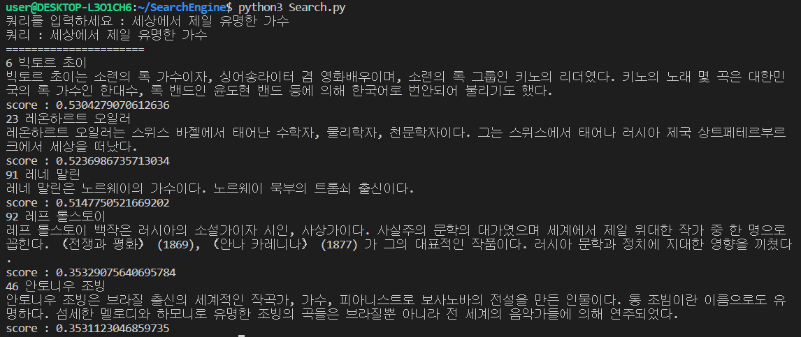

# SearchEngine
## Spec
- Search console (HTTP)
- Search Algorithm
    - tf-idf
    - cosine score

## Requirements
- konlpy (Mecab)
- g++
- openjdk-8-jdk
- python3-dev
- python3-pip
- curl

`sudo apt-get install g++ openjdk-8-jdk python3-dev python3-pip curl`  
`python3 -m pip install --upgrade pip`  
`python3 -m pip install konlpy`  
`sudo apt-get install curl git`  
`bash <(curl -s https://raw.githubusercontent.com/konlpy/konlpy/master/scripts/mecab.sh)`  

## Use
`python3 Search.py`  

## result

